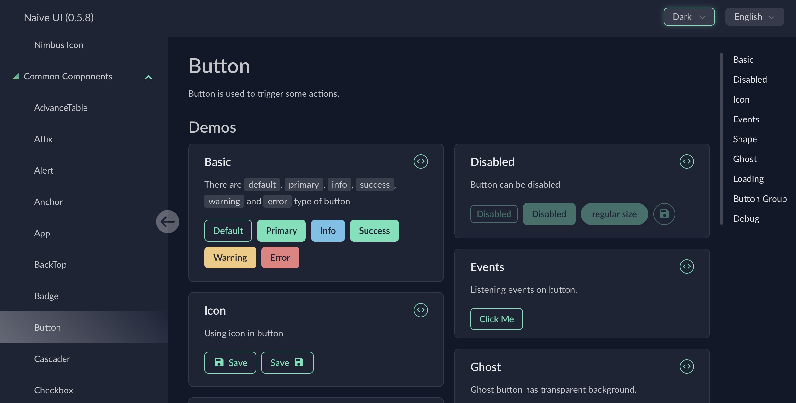
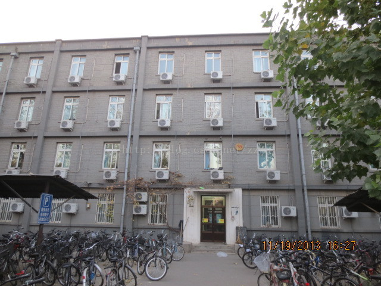
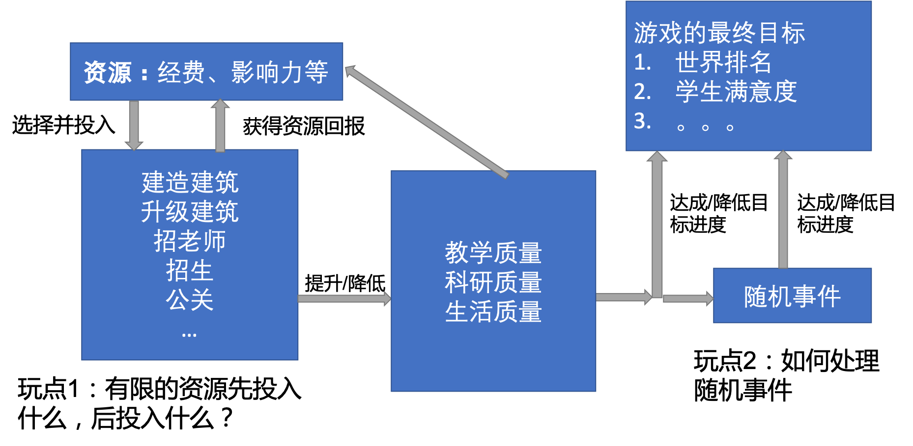
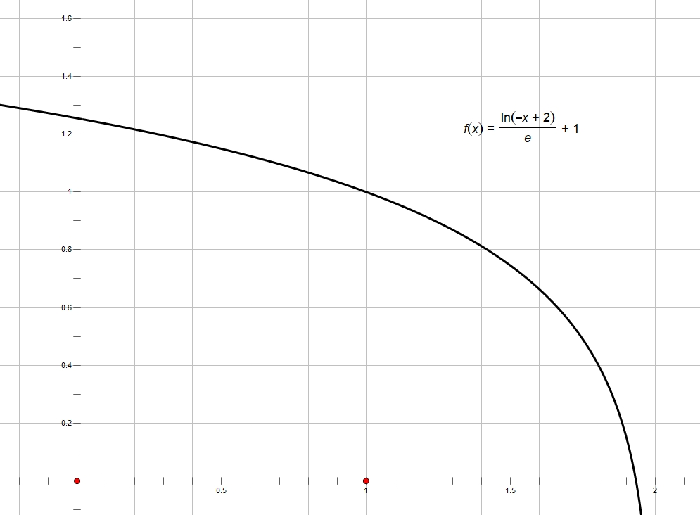

# Project: University Sim游戏设计文档

## 概念陈述 

### 游戏标题

项目代号：Project: University Sim

可选最终名称一：《品质校园模拟器》

可选最终名称二：《建设世界一流大学》

### 游戏概述

这是一个让玩家利用手里的资源规划建设一所大学的回合制策略游戏。

### 游戏标签

策略、模拟、文字、荒诞、黑色幽默

### 目标受众

任何一个有过大学生活经历的人，尤其是在北京某全是建筑工地的大学里经历过中国特色大学教育的人，会在这个游戏中得到更加深刻的感触~

### 独特之处

1. **独特的游戏背景**。据我们所知，没有策略/模拟经营类游戏曾经尝试模拟建设和发展一所中国大学的全过程，以中国大学为背景的游戏基本都是AVG/Galgame。因此，这个游戏能提供全新的独特体验。
2. **“想着再来一回合，不知不觉就天亮了”**。正和诸如《文明》、《群星》这类策略游戏代表作一样，我们希望这个游戏能够通过设计大量相互重叠的短期目标和即时反馈，给玩家欲罢不能的游戏体验。
3. **幽默的游戏叙事**。我们计划在游戏中添加大量的随机事件和“梗”，使人眼前一亮，捧腹大笑。
4. **深刻的启发意义**。虽然做到这个也许有点难，但是我们希望玩家能够从中得到一些对于中国大学现实的启发，能让这个世界变好一点点（划掉）。

## 产品设计概述

### 玩家视角

在这个游戏里，玩家是一所大学的“虚拟的最高控制者”，正如在P社游戏里玩家是一个国家的“虚拟的最高统治者“那样。游戏的背景就是2019年的中国，尽管我们在游戏背景里不会试图明确表达这一点。我们希望这个游戏能让玩家体验到建设一所大学过程中的爽快（以及潜在的混乱和邪恶）。我们必须设计一些长期目标和大量的短期游戏目标能够让玩家一直玩下去。

### 美术风格

#### UI

这个游戏是纯文字游戏，附以少数图片。因此，游戏的美术主要集中于UI设计上。游戏UI的整体设计风格与配色我们准备参考[Naive UI Dark Theme](http://www.naiveui.com/en-us/dark/start)的配色与组件设计，截图参考如下。不过，由于游戏开发与网页开发的不同，我们必须开发自己的游戏UI组件库。



这个游戏的字体一律使用Arial。

关于UI颜色的详细参数参见`assets/Scripts/Color.js`

#### 图片

游戏里面关于建筑与人等，不可避免地需要使用一些图片。这些图片我们准备采用实景拍照的方式。比如如果要显示一个破旧的宿舍楼，我们可以直接使用网上关于北京大学28楼的照片。



如果有必要的话，也可以采用Photoshop对这些图片进行一定的处理，比如使用这样的图片。


### 音乐风格

暂定。由于微信小游戏的4MB包大小限制，最后也有可能没有任何音乐。

### 背景设定

《建设世界一流大学》是一个极简的策略类模拟游戏，你的任务是规划一所中国大学的建设与发展，规划学校政策，建设品质校园，力争为师生打造能够高效学习与科研的环境，为世界一流大学的建设添砖加瓦！你的合理建设能使得师生全身心投入学习与科研，国际排名不断上升，最终成为世界一流大学！不过，如果你的建设有问题的话，会发生什么就不得而知了...

### 技术选型与项目规划

| 目标平台                              | 桌面端网页/移动端网页/微信小程序 |
| ---------------------------------- | ----------------------------------------------- |
| 画面技术                           | 2D游戏 (Cocos2D, WebGL)                         |
| 编程语言                           | JavaScript                                      |
| 主要框架                           | Cocos Creator                                   |
| 团队人数                           | 3人                                             |
| 制作时间                           | 11周的零碎时间                                  |
| 迭代次数                           | 4轮迭代                                         |
| 主要风险一                        | 游戏引擎的学习成本                              |
| 主要风险二 | 成员能否进行持续而有效的时间投入 |
| 主要风险三 | 能否在有限迭代内达到较高的可玩水准 |

## 游戏系统设计

### 核心游戏循环



### 游戏的目标与进展

玩家在这个游戏里的核心目标在于提升自己大学的世界排名，并将学生和教授的满意度控制在一个合理的水平。为了达成世界一流大学的目标，游戏中会有一组阶段性的任务辅助玩家推进。这些阶段性目标的描述分别是成为二本、一本、211、985、等等。

玩家需要追求的核心目标有以下五个：

1. 学业水平 StudyIndex，用于衡量这所学校教学水平的高低。影响这个指标的因素可以包括教学楼的质量、教学经费的投入、老师的素质和满意度、学生的素质等等。
2. 科研能力水平 ResearchIndex，用于衡量这所学校科研水平的高低。影响这个指标的因素可以包括师生的素质、老师学生的满意度、科研环境的质量、科研的经费投入等等。
3. 职业能力水平 CareerIndex，用于衡量这所学校学生工作竞争力。这个数值会受到学生满意度、教学质量、科研质量等等许多因素影响。
4. 生活质量满意度 LivingConditionSatisfaction，用于衡量这所学校学生满意度的水平。该指标又分为多种下级指标，如清洁满意度 cleaningSatisfaction，休息环境满意度 relaxationSatisfaction, 学习环境满意度 studyingSatisfaction。这些因素会受到建筑质量、教学质量、科研质量等因素的影响，并且随着学校排名的上升，要维护学生的满意度会变得越来越困难。如果满意度低，会对学生的个人能力产生很大影响，并产生无法预料的随机事件。

国际排名的计算方式如下：排名用数值 = 生活质量满意度 * 学业水平 * （科研能力水平 + 职业能力水平）。数值越高越靠前。

为了反映国际排名竞争的激烈性，我们会随机生成500所大学与玩家的大学竞争，并且会对这些大学赋予不同的类型，有的大学各个指标数值会上升，有的大学的各个指标数值会下降，有的大学会随机波动等等，为玩家的排名爬升之路创造随机感。

对于阶段性任务，我们会对上述指标设置一个固定的数值，确保玩家能够达成。目前的设计如下：

1. 阶段一：评为二本院校。达成条件：各类满意度 > 60%，学业水平 > 60%，职业能力 > 60%.
2. 阶段二：评为一本院校。达成条件：各类满意度 > 70%，学业水平 > 70%，职业能力 > 70%.
3. 阶段三：评为211高校。达成条件：各类满意度 > 80%，学业水平 > 80%，职业能力 > 80%.
4. 阶段四：评为985高校。达成条件：各类满意度 > 85%，学业水平 > 85%，职业能力 > 85%，科研能力 > 75%.
5. 阶段五：成为双一流高校。达成条件：各类满意度 > 90%，学业水平 > 90%，职业能力 > 90%，科研能力 > 90%.

### 游戏系统

#### 1. 时间系统

为了营造一种时间在流逝的感觉，我们选择基于Tick的时间系统（类似P社四萌）来配合整个游戏的推进。在这个系统里，一个tick是一秒钟，一天5个tick，分别对应上午、中午、下午、晚上、凌晨。一般学生会在上午下午主要进行的活动是上课，中午晚上吃饭，凌晨睡觉。在周末或者无课时间段学生会进行其他种类的活动。一学期共20周，一年两个学期，这样一个游戏年的游戏时长就是大约20分钟，一局需要10-50个游戏年完成。此外，玩家可以自行调整游戏的速度，随着游戏迭代的推进，我们可能会改变时间流逝的速度和一局的期待游戏时间。

#### 2. 资源系统

这个游戏有两个核心资源：经费与声誉。这两个资源承担的是不同的功能，稀有程度也不同。经费是相对获得方式比较多、数量比较大的资源；声誉是获得方式稀少、数量比较少的珍贵资源，玩家决定投入声誉做某件事情时必须更加小心。

经费的获得方式包括：

1. 每学期的固定资金。在每学期开始时玩家会获得一笔固定的经费。这笔经费的数量取决于玩家的评级是二本、一本、985等；也取决于学生的数量，模拟现实世界中的定额学费；此外，还取决于玩家的科研建筑数量，对应现实世界中的科研经费。
2. 每周的固定资金。在每周开始时玩家可能会获得一笔经费。这笔经费可以是玩家开食堂、咖啡厅、小卖部、校办科创企业等获得的资金。

经费的使用方式包括：

1. 建造和升级建筑。
2. 招募教授。
3. 消耗经费处理随机事件。
4. 消耗大量经费推动某项政策。
5. 折旧摊销等费用，每周固定扣除。

声誉的获得方式包括：

1. 当完成某个阶段性任务时一次性获得。
2. 处理随机事件时获得或失去。
3. 每周获得一个固定的量。这个量的多少取决于学生满意度和教授满意度。

声誉的使用方式包括：

1. 建造和升级一些特殊的顶级建筑。
2. 招募一些特殊的顶级教授。
3. 推动一些特殊的顶级政策。
4. 消耗声誉处理随机事件，特别是与公关有关的事件。

#### 3. 建筑系统

这个游戏的核心系统之一就是建筑。玩家的核心决策就包括在空间有限的校园内，建造什么样的建筑、升级什么样的建筑、如何在不同建筑之间做权衡、如何在有限的校园空间内合理规划拆除和建设的路线等。由于建造一个建筑需要的时间很长，我们希望玩家在整个拆除建筑的时候会非常小心。

建筑有一个特定的建筑类型，拆除和升级建筑需要耗费大量的时间。不过我们可以给建筑添加不同的组件，实现个性化维度属性的提升。

建筑类别：教学楼、宿舍、食堂、图书馆、研究所、体育馆、剧院等。

部分组件不同建筑通用，如清洁升级。也有些建筑可以拥有其特殊的组件，如咖啡厅、小卖部、打印店，宿舍可以选择从八人间升级到四人间，单人间等等。

#### 4. 人事系统

人事系统分为两大块：学生和教授。我们对学生和教授采用不同的模拟策略。

对于学生，我们只关注全部学生各项数值的平均值，学生的核心数值在于能力和满意度，这些数值会受到其他机制的影响。玩家需要在人事系统中决定学生的招生策略。

对于教授而言，玩家需要手动决定他需要招募哪些教授，并满足这些教授的需求，合理分配。

#### 5. 舆论系统

舆论系统也就是这个游戏的随机事件系统。我们希望在舆论系统中能够模拟大学校园中常见的各种突发事件，并且逼迫玩家对这些突发事件作出处理。

舆论系统分为两个模块：触发器和触发内容。在触发器中，我们需要定义一组事件触发的规则。可能的触发规则包括学生满意度低于一定数值等等。在触发内容中，我们需要定义这些事件会如何运行。可能的事件包括：

1. 学生发树洞
2. BBS上出现热门贴
3. 学校上微博热搜和知乎热榜

以上三类事件的效果从小到大、可能是正面的也可能是负面的。我们希望学生发树洞是一个动态的不断生成的过程，而后两者是偶然发生的，并且发生时需要玩家做出决策。

舆论系统的实现是这样的，我们首先需要有一个类来管理所有的事件。所有的事件可以被分成很多类，每一类事件组成一个事件列表，这个列表从前往后负面性减少，正面性增加。每一个事件列表上的事件都是同一类满意度在不同正负面和严重程度情况下的具体反映。

例如，如果要模拟学生的学习满意度，可以针对满意度的高低设计一组正负面和严重程度各不同的事件，根据满意度数值的高低和变化来触发。类似以下五个事件 1-2-3-4-5 1是负面事件（学生跳楼），2是微负面事件(学生发树洞说自己菜），3是中立事件(学生在树洞上问题目），4是微正面事件（学生努力学习），5是正面事件(媒体报道）。

由于学生的舆论是逐渐积累出来的，突发事件产生也绝非一朝一夕之功，所以我们的触发条件与满意度数值绑定，并且由于满意度已经体现出了随时间慢慢变化的特点，所以舆论系统其实只用判定满意度数值就可以作出判断。不过，我们必须不能让一个事件的触发变得过于频繁，所以每一个事件触发后都有冷却时间。事件的触发算法是这样的。

```
for each tick:
    for each 事件链:
        如果他已经冷却完:
            根据对应的指标触发事件
            触发后赋予一个随机的冷却时间，开始冷却
```

#### 6. 政策系统

政策系统 反应的是学校的管理者投入资源进行一项重大改革的过程。这个改革的结果往往是会产生一些整体的全局Buff，可能有正面也可能有负面，但是整体上有益于建设世界一流大学的目标。

政策举例：

1. 实行Tenure Track制度。需要投入100万经费、50点声誉。效果：科研指数+100%、教学指数-10%、教授满意度-10%.
2. 实行食堂承包制度。需要投入10万经费、20点声誉。效果：食堂收入+50%、学生满意度-5%、可能出现随机食品安全事件.
3. 实行”品质校园“政策。需要投入200万经费、100点声誉。效果：全部学校收入+100%、学生满意度-10、可能出现负面随机事件.
4. 建设生涯与职业规划辅导制度。需要投入90万经费、10点声誉。效果：学生职业能力+20%.

#### 7. 指标系统

##### 7.1 满意度系统
1. 满意度是指标的一类，满意度系统是指标系统的一个子系统。满意度系统又分为被动满意度和主动满意度。
2. 被动满意度是随建筑被动变化的，如果建筑不支持该类满意度，则满意度不变化。例如教学楼有学习环境满意度，学生在教学楼时学习环境满意度会变化；食堂没有学习环境满意度，学生在食堂时学习环境满意度不变化。
3. 主动满意度大部分建筑不会提供，需要学生主动前往相应建筑获取。例如学生在教学楼，寝室和食堂一般不会获取锻炼健身相关的满意度，学生需要前往操场等建筑提升这类满意度。
4. 满意度的默认更新逻辑是综合当前建筑的满意度和历史满意度得到新的满意度。具体来说是加权平均，历史满意度占0.95而当前建筑满意度占0.05. 当前建筑满意度由该建筑默认的满意度经过修正得到。目前的修正有拥挤度修正。拥挤系数定义为当前建筑内人数与建筑容量之比，拥挤系数经过如下函数得到一个满意度修正系数，与默认满意度相乘得到最终的建筑满意度（大于1时降为1）。



5. 各类综合满意度由所有学生的相应类别满意度做算术平均得到。下轮迭代已计划引入更复杂的综合满意度计算公式，将提高低满意度学生的权值。

##### 7.2 学业指标
学业指标是评价学校的主要指标之一。无论是学习相关的各类满意度还是生活相关的各类满意度都会影响学业指标。
每名学生有一个固定的天赋值。我们通过一个简单的模型来抽象人的学习天赋，即他在各方面条件都达到最满意，最理想，投入最大精力时，所能取得的成绩。从数据上讲，满意度会逐渐趋向于天赋值与各方面满意度的综合值之积，该综合值中学习相关的满意度占比较大，但生活相关的满意度也会出现并造成一定影响。
要提高学生的学业指标，可以通过提高满意度来实现，但最多只能让学生尽量展现出其天赋。要取得更好的成绩，则必须录取资质更好的学生，参见录取部分。
新生学业指标为天赋值 * 0.45.

#### 8 招生录取系统
每学年会有学生毕业，新生入学。

非大四学生可能提取毕业，而大四学生也可能延期毕业，最终效果是随机25%的学生能够成功毕业。

入学新生的天资与学校质量有关。毕业生的能力越强，学校的名声越好，越能吸引高素质学生入学，从而在经营得当的情况下形成良性循环。这一过程的数学模型可以如下描述。要不断吸引天赋更高的学生入学，则需要提高学生各方面的满意度，使之取得更好的学业成绩。而要维持更高的新生素质，则需要更高的满意度。要天赋维持x (0 <= x <= 1)的学生入学，需要 3x/4 + 1/4 的满意度。预期毕业水平为x(3x/4 + 1/4). 招生时已知毕业水平为y，则反求新生天赋为 x = (sprt(1 + 48y) - 1) / 6. 例如要维持0.4天赋的新生入学，需要0.55综合满意度，他们毕业时的学业水平大致分布在0.22附近。而要维持0.8天赋的新生入学，需要0.85综合满意度，他们毕业生的水平分布在0.68附近。
若招生时先前没有学生（如游戏开始时和长期不招生），则新生的天赋为 0.28，需要 0.46满意度来维持（开局满意度约在0.50附近）。


### 游戏交互

我们希望这个游戏能够同时部署到桌面端和移动端，因此我们希望玩家的交互方式只有两个：点击和拖动。我们希望游戏的字体足够大从而能够在移动端上也能看清楚。我们应该避免诸如悬停弹出窗口、键盘按键之类的只有电脑才支持的操作。在游戏的过程中，我们希望玩家能反复地在各个游戏窗口之间查看信息并作出决策。可以作出的决策包括设置招生策略、招新老师、建造建筑、升级建筑、投入资源举行一项政策、处理随机事件等等。